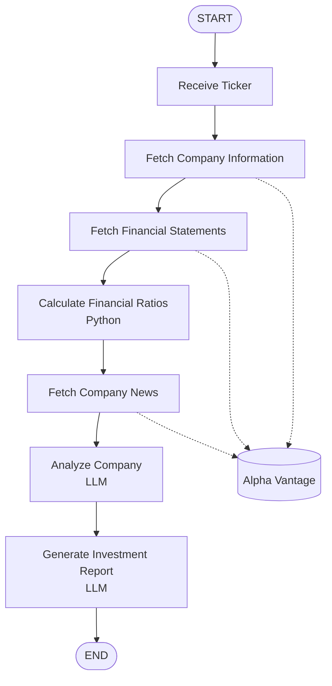

# Financial-Analyst
Financial Analyst integrated with LangGraph to gather financial information to analize companies

## MVP

### Problem solved
AI Investment Analyst is a CLI-based AI financial research assistant that analyzes publicly traded companies using financial data, news, and other relevant sources. Built with Python and LangGraph, it orchestrates AI agents and specialized tools to research companies, evaluate their fundamentals, identify potential opportunities and risks, and generate detailed investment reports.

The project is aimed at investors and anyone interested in learning about financial analysis and investing.

### LangGraph Flow and tools

LangGraph Flow to gather and analyze information:

Alpha Vantage provides the API used to retrieve financial information, including company data, financial statements, and news.

Ruta de trabajo
1
Definir el MVP
Qué problema resuelve, quién lo usa y qué debe entregar.
Resultado: alcance del proyecto.

2
Diseñar la arquitectura
Definir agentes, herramientas, base de datos y flujo de LangGraph.
Resultado: diagrama y responsabilidades.

3
Construir el primer grafo
Planner → herramientas → Analyst → respuesta.
Resultado: primer agente funcional.

4
Integrar datos financieros
Precios, estados financieros y noticias mediante APIs.
Resultado: análisis con datos reales.

5
Agregar validación y memoria
Reviewer, checkpoints, historial de análisis y preferencias.
Resultado: sistema más robusto.

6
Interfaz y observabilidad
API FastAPI, dashboard sencillo, logs y métricas.
Resultado: producto demostrable.
